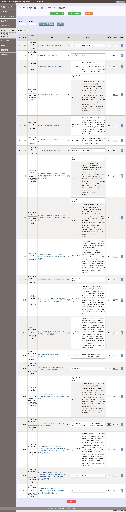

# hokuriku-gift-campaign

<https://welcome-hokuriku.jp> で回答されたアンケートのデータをオープンデータとしたものです。

[北陸インバウンド観光DX オープンデータ可視化ウェブアプリケーション](https://hokuriku-inbound-kanko.github.io/hokuriku-inbound-kanko-visualization/) で利用され、グラフとして閲覧可能になっています。

本リポジトリは[北陸インバウンド観光DX・データコンソーシアム](https://github.com/hokuriku-inbound-kanko)によって公開されています。

## アンケートについて

質問内容と回答の選択肢については以下の画像を参照下さい。

